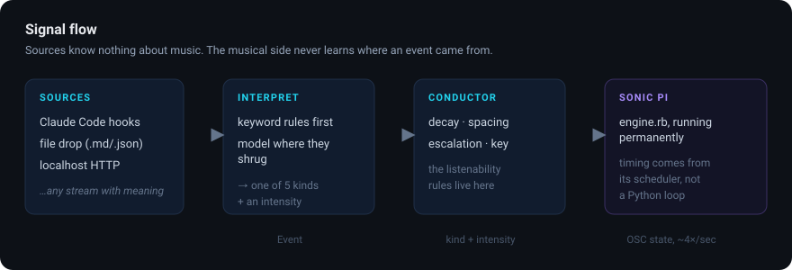
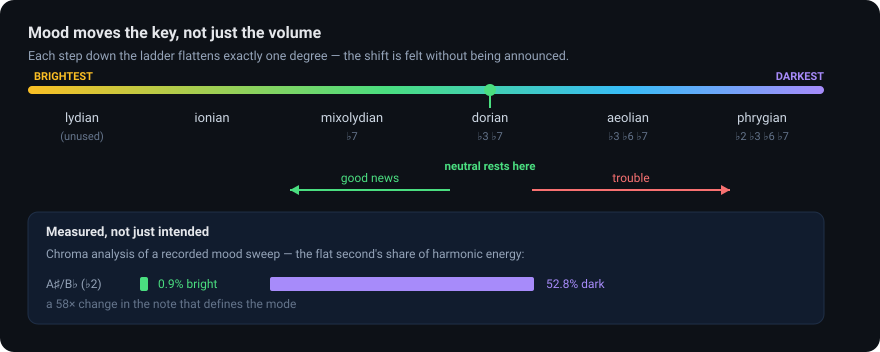
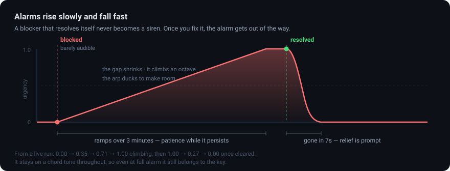

# The Agentisizer

**Hear what your agents are doing.**

You have coding agents working. Reading every transcript means babysitting;
ignoring them means missing the moment one gets stuck. The Agentisizer turns
that stream into a live soundtrack you can leave running in the background —
so you can do something else and still know, without looking, that work is
happening, that something went wrong, or that something has been waiting on
you for five minutes.

A modular synthesiser in the Moog sense: sources patch into a musical engine.
Claude Code agents are just the first input module. The same stack takes any
stream with semantics — APIs, market data, build pipelines, sensors.

```bash
./run-agentisizer.sh setup     # get Sonic Pi installed and running
./run-agentisizer.sh demo      # 90-second tour of every state
./run-agentisizer.sh start     # leave it running
```



🎧 **[Hear it](docs/sample_demo.mp3)** — a 73-second run through calm, work,
good news, trouble, a blocker escalating, and relief.

## What it sounds like

A slow pad that never stops, quiet enough that you stop noticing it within a
minute. Everything else arrives only when there is something to say:

| What happened | What you hear |
| --- | --- |
| **nothing** | near silence — a slow pad, no pulse |
| **agents working** | the pulse and an arpeggio come in; busier work means denser and brighter |
| **good news** | a bright bell figure up the current chord |
| **bad news** | in-key dissonance settles underneath — a flat second against the root |
| **blocked** | a low pulse that gets more insistent the longer it is ignored |
| **resolved** | a falling figure lands on the root, tension drops away |

And underneath all of it, the **key itself moves with the mood**.

## Mood changes the harmony, not just the volume



The modes of the major scale form a natural brightness ordering. Each step
down flattens exactly one degree, so neighbouring modes differ by a single
note and the shift is felt without being announced.

Good news walks up that ladder, trouble walks down it. Neutral rests in
**dorian** — over hours, natural minor reads as mournful where dorian just
reads as calm. Tension is weighted harder than valence, because a soundtrack
that turns radiant the moment one test passes is one nobody believes.

The payoff is at the dark end. Tension is voiced as a **flat second** against
the root. In dorian that note is a chromatic outsider, fighting the key. In
phrygian the flat second is *diatonic* — so as things get worse, the key
moves to meet the dissonance, and the note that was fighting the harmony
becomes the harmony. Trouble resolves into character rather than damage.

This is measurable, not just intended — the chroma figures above come from
analysing a recorded mood sweep. Mixolydian's ♭7 carried 38.9% of the bright
segment; phrygian's ♭6 carried 23.0% of the dark one. The mood is genuinely
rewriting the harmony.

The **key** moves too, but rarely: one step every eight minutes, only through
closely related keys (A → D → C → E), and **never while tension is high** —
modulating mid-crisis sounds like the floor moving. Python decides which key
and mode the mood calls for; the engine holds the change until a phrase
boundary, because *when* a key change lands is a timing decision and timing
lives in Sonic Pi.

`./run-agentisizer.sh start` prints the current key beside each event, so you can see
the harmony track the narrative:

```
progress  · refactoring the parser across nine files   A dorian
bad       ~ the fix broke authentication as well       A aeolian
blocked   · need the staging database password         A phrygian
resolved  · credentials received, deploy is green      A dorian
```

(`·` means the keyword rules decided, `~` means it went to the model.)

## The part that actually matters

Anyone can trigger a sound on an event. The hard part is building something a
person can stand to have on for six hours. Almost every rule here exists to
defend that:

**Nothing picks a raw pitch.** Data selects a *degree* of the current chord,
so every note is consonant by construction. Mapping numbers to frequencies is
what makes sonification unbearable.

**Loudness is a budget, not a dial.** When the alarm rises, the arpeggio ducks
to make room. Across the entire emotional range of the demo — idle through
full alarm — measured loudness stays inside a 5.4 dB band. Urgency arrives as
a change in *balance*, never as a volume war.

**Fifty events do not make fifty sounds.** Event *rate* becomes a continuous
`activity` level; accents are rate-limited per kind. Routine progress never
gets an accent at all — it is the texture, not an item in a queue.

**Everything decays toward calm.** If the music can't return to quiet, the ear
stops hearing any of it within twenty minutes and the whole thing is pointless.

**Alarms rise slowly and fall fast.** A blocker ramps over three minutes, so a
problem that resolves itself in thirty seconds never becomes a siren. Once you
fix it, the alarm is gone in seven. An alarm that nags after the fix is the
one you mute.



**Bad news is dissonant *within the key*.** A flat second reads as tension
because the ear can place it — not because it hurts.

## How it fits together

```
sources ──► interpreter ──► conductor ──► Sonic Pi engine
(many)      (one)           (one)          (persistent)
```

The seam that matters is between **what happened** and **what it sounds
like**. An input module produces `Event` objects and knows nothing about
music. The musical side never learns where an event came from. That is why a
new source is a small file instead of a rewrite.

- **`agentisizer/events.py`** — the one shape everything collapses into.
- **`agentisizer/interpret.py`** — natural language → one of five kinds:
  keyword rules first, a model only where they shrug.
- **`agentisizer/conductor.py`** — musical state, decay, spacing, escalation.
  The rules above live here.
- **`agentisizer/musical.py`** — key and mode selection: the brightness
  ladder, and the rules about when it is safe to modulate.
- **`agentisizer/sources/`** — one file per input. `filedrop.py` is ~100 lines
  and does nothing clever; copy it to add your own.
- **`engine/engine.rb`** — runs *inside* Sonic Pi, permanently.

### Why the engine lives in Sonic Pi

Python sends **state**, not notes. `/run-code` carries whole programs and is
used three times in a session: to load the engine, to stop it, and once during
`setup` to check Sonic Pi can actually execute. Everything else — every event,
for hours — is an OSC cue to a program already running and listening.

That means timing comes from Sonic Pi's scheduler rather than from a Python
loop with `sleep()` in it. Notes land on the beat because a real sequencer is
placing them. Sending code per note is what makes these systems sound like a
machine gun.

## Sending events

**Any language, no client library** — write a file:

```bash
echo "all tests passed" > ~/.agentisizer/events/$(date +%s%N).md
```

With frontmatter, if the agent already knows what it is reporting:

```markdown
---
kind: blocked
intensity: 0.9
source: deploy-bot
---
Waiting on the staging database credentials.
```

**Or HTTP**, on localhost:

```bash
curl -s localhost:8912/event -d '{"text": "TypeError in parse_headers"}'
curl -s localhost:8912/state
```

**Or the CLI:**

```bash
./run-agentisizer.sh say "deploy is green again"
```

`kind` is optional everywhere. Leave it out and the interpreter decides.

> **Working on this with an AI agent?** [`AGENTS.md`](AGENTS.md) has setup,
> the semantics of each `kind`, integration patterns, and the etiquette that
> keeps the soundtrack informative.

### Claude Code

Add a hook that posts tool events as they happen:

```json
{
  "hooks": {
    "PostToolUse": [{
      "hooks": [{
        "type": "command",
        "command": "curl -s -m 1 localhost:8912/event -d \"{\\\"text\\\": \\\"$CLAUDE_TOOL_NAME finished\\\", \\\"source\\\": \\\"claude-code\\\"}\" >/dev/null || true"
      }]
    }]
  }
}
```

## The interpreter: rules first, model second

Classification is a language judgement, so there is a model involved — but
which decides *what* was chosen by measurement, not by preference.

Benchmarked on twenty real agent phrasings, ten containing obvious keywords
and ten deliberately without (`./run-agentisizer.sh bench` runs this):

| | score | cost |
| --- | --- | --- |
| keyword rules alone | 14/20 | 0.1 ms |
| llama3.2:3b alone | 14/20 | 2.07 s |
| **rules first, model on the rest** | **16/20** | 1.18 s |

The two are wrong about *different* things. Every single rule miss was a
fall-through — when a rule fires it is reliable; when none fires the answer
is a shrug. The small model is the opposite: good at reading a sentence with
no keywords in it, and prone to overreading a plain one ("permission denied,
cannot continue" came back as `bad` rather than `blocked`).

So the rules go first, and the model is asked only when they have nothing to
say. That beats either alone, and most events never reach the model at
all — they are classified in microseconds, and the latency budget is spent
only where it buys something.

**The model classifies. It does not compose.** It returns one of five kinds
and a number, and cannot reach the synth. Everything musical downstream is
bounded by the conductor. A bad classification makes the soundtrack briefly
wrong, never unpleasant — letting a language model drive audio parameters
directly is how you get something nobody leaves running.

The rules are not a stub; they are tested like a feature, because with no
model configured they *are* the product. Every case in
`tests/test_interpret.py` under "cases that were wrong on the first real run"
is one they actually got wrong against real agent phrasing.

If you use a local model, keep it small and non-reasoning. A 12B reasoning
model measured 27–80s per classification — it spends its token budget
thinking before answering a one-word question, which is the wrong trade
here. `llama3.2:3b` is the reference.

```bash
./run-agentisizer.sh doctor
```

`doctor` makes a real call rather than reporting configuration — a stale API
key still looks configured, and the fallback is silent by design, so this is
the only place a degraded setup surfaces. It warms the model first and times
the *second* call, because Ollama unloads idle models and a cold call measures
disk-to-GPU load rather than classification.

With `--backend auto` (the default) the runners-up are kept. If the first
choice fails twice it demotes to the next, so an expired `OPENROUTER_API_KEY`
cannot shadow a working local model — which it did, until it was caught:

```
HTTP 401 — {"error":{"message":"User not found."}} — trying ollama
✓ ollama:llama3.2:3b (1.93s per call)
```

## Commands

Everything runs through the wrapper. There is no bare `agentisizer` on your
PATH unless you `pip install .` deliberately — the wrapper builds and uses its
own virtualenv, so there is nothing to activate.

| | |
| --- | --- |
| `./run-agentisizer.sh setup` | install Sonic Pi if needed, launch it, verify it responds |
| `./run-agentisizer.sh doctor` | check each layer and say which one is broken |
| `./run-agentisizer.sh demo` | 90-second tour of every state (`--record FILE` to keep it) |
| `./run-agentisizer.sh start` | run the soundtrack until you stop it |
| `./run-agentisizer.sh say "..."` | send one event (`--kind`, `--intensity`, `--source`) |
| `./run-agentisizer.sh bench` | score the classifier against the keyword rules |
| `./run-agentisizer.sh test` | run the test suite |

Global flags: `--backend {auto,openrouter,ollama,heuristic}`, `--model NAME`,
`--port N`.

First run builds the virtualenv (~15s); after that it goes straight to the
command. `setup` and `doctor` also create `~/.agentisizer/events/`, so the
file-drop integration works before the daemon has ever run.

## Requirements

- **Sonic Pi 4 or 5** — `./run-agentisizer.sh setup` will install and launch it
- **Python 3.10–3.13** — the wrapper builds its own venv; 3.14 is not usable
  yet on Homebrew (broken `ensurepip`)
- An LLM is **optional** — the rules run alone perfectly well. If you want one,
  `ollama pull llama3.2:3b` is the verified setup; check it with
  `./run-agentisizer.sh bench`.

## Status

Alpha, and honest about it. The engine, conductor, both input modules and the
CLI work and are verified against Sonic Pi 5.0 — every number in this README
was measured on a real run, and `tools/check_docs.py` runs with the tests so
the commands and paths here cannot drift from the code. Rough edges:

- The model still misses things the rules do too — "that did it" reads as
  `progress`, not `good`. 16/20 is a floor, not a ceiling;
  `./run-agentisizer.sh bench` is there to make improvements measurable
  rather than felt.
- OpenRouter is implemented but has only been exercised against a dead key.
  The local path is the verified one.
- Long-form variation is still thin. Key and mode move with mood, but there
  is one progression shape per brightness region and no section structure
  above the 16-bar phrase.
- The cohesion supervisor is currently rules-only. The hooks for an LLM to
  propose bounded adjustments are in `Conductor.gain_trim` / `density_trim`,
  but nothing drives them yet.
- `setup` installs Sonic Pi through Homebrew. That branch is the one path
  not exercised here, since verifying it would mean uninstalling a working
  copy — if `brew install --cask sonic-pi` misbehaves you are on your own for
  a moment, and everything after it is tested.
- Only tested on macOS.

## Licence

MIT. See `LICENSE`.
